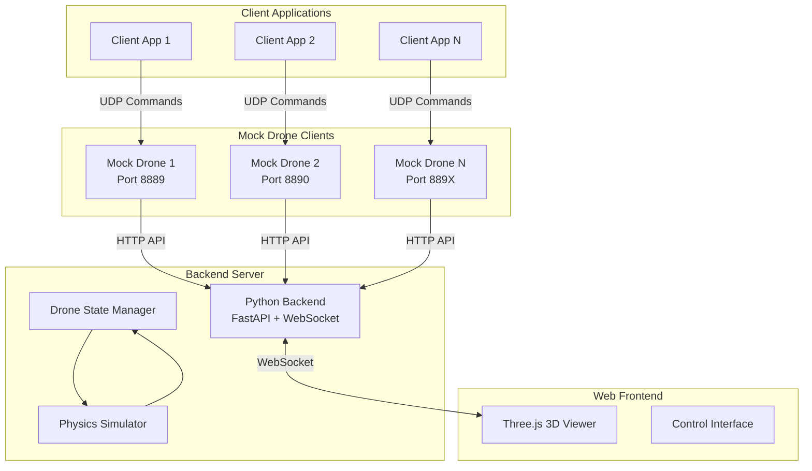

# Design Document

## Overview

The RoboMaster TT 3D Simulator is a comprehensive simulation environment that provides a realistic 3D web-based testing platform for RoboMaster TT drone applications. The system consists of three main components working together to deliver accurate drone simulation with full UDP protocol compatibility:

1. **Mock Drone Clients** - Python UDP servers that simulate individual RoboMaster TT drones with realistic physics and telemetry
2. **Python Backend Server** - FastAPI-based server with WebSocket support for real-time state management and communication
3. **Web Frontend** - Three.js-based 3D visualization interface with interactive camera controls and real-time drone monitoring

The system architecture follows a distributed design where multiple mock drone clients run independently on unique UDP ports (8889, 8890, 8891, etc.) to simulate different drone IP addresses. This allows developers to test multi-drone scenarios and swarm behaviors on a single machine without requiring physical hardware. Each mock drone client maintains realistic physics simulation, telemetry data generation, and full RoboMaster TT protocol compliance, ensuring existing drone control code works without modifications.

## Architecture



### Communication Flow

1. **Command Reception**: Mock drone clients receive UDP commands from client applications
2. **Command Processing**: Each mock drone processes commands according to RoboMaster TT protocol
3. **State Updates**: Mock drones send state changes to the backend server via HTTP API
4. **State Broadcasting**: Backend server broadcasts updates to all connected web clients via WebSocket
5. **Visualization**: Web frontend updates 3D scene based on received state changes

## Components and Interfaces

### Mock Drone Client

**Purpose**: Simulates individual RoboMaster TT drones by implementing the complete UDP command protocol.

**Key Classes**:
- `MockDrone`: Main drone simulation class
- `UDPCommandHandler`: Processes incoming UDP commands
- `DroneState`: Maintains current drone state (position, orientation, battery, etc.)
- `PhysicsEngine`: Handles realistic movement and physics simulation
- `TelemetrySimulator`: Generates realistic sensor data

**Interfaces**:
```python
class MockDrone:
    def __init__(self, drone_id: str, udp_port: int, backend_url: str)
    def start_udp_server(self) -> None
    def process_command(self, command: str) -> str
    def update_state(self, state_update: dict) -> None
    def send_state_to_backend(self) -> None
```

**UDP Command Processing**:
- Control Commands: `command`, `takeoff`, `land`, `emergency`, `up`, `down`, `left`, `right`, `forward`, `back`, `cw`, `ccw`
- Movement Commands: `go x y z speed`, `curve x1 y1 z1 x2 y2 z2 speed`, `flip x`
- Setting Commands: `speed x`, `rc a b c d`, `wifi ssid pass`
- Read Commands: `speed?`, `battery?`, `time?`, `wifi?`, `sdk?`, `sn?`

### Python Backend Server

**Purpose**: Central coordination server that manages drone states and provides WebSocket communication to web clients.

**Key Classes**:
- `BackendServer`: Main FastAPI application
- `DroneStateManager`: Manages all drone states and coordinates updates
- `WebSocketManager`: Handles WebSocket connections and broadcasting
- `ConfigManager`: Manages simulation configuration

**API Endpoints**:
```python
# Drone state management
POST /api/drones/{drone_id}/state
GET /api/drones
GET /api/drones/{drone_id}
DELETE /api/drones/{drone_id}

# Configuration
GET /api/config
POST /api/config
```

**WebSocket Events**:
```javascript
// Outbound events
{
  "type": "drone_state_update",
  "drone_id": "drone_1",
  "state": { ... }
}

{
  "type": "drone_added",
  "drone_id": "drone_1",
  "initial_state": { ... }
}

{
  "type": "drone_removed",
  "drone_id": "drone_1"
}
```

### Web Frontend

**Purpose**: Provides 3D visualization and user interface for monitoring drone simulation with real-time telemetry display and interactive camera controls.

**Key Components**:
- `Scene3D`: Three.js scene management with coordinate system and ground plane
- `DroneRenderer`: 3D drone model rendering with distinct visual identifiers and port labels
- `CameraController`: Interactive camera controls (rotate, zoom, pan) for scene navigation
- `WebSocketClient`: Real-time communication with backend server
- `UIController`: User interface for telemetry display and simulation monitoring

**Three.js Scene Structure**:
```javascript
scene
├── ambientLight
├── directionalLight
├── gridHelper (ground plane)
├── axesHelper (coordinate system)
├── drones/
│   ├── drone_1 (Group)
│   │   ├── droneModel (Mesh)
│   │   ├── propellers (Group)
│   │   ├── portLabel (Sprite)
│   │   └── statusIndicator (Mesh)
│   └── drone_2 (Group)
└── camera
```

**User Interface Elements**:
- Real-time telemetry panel (battery, speed, position, temperature, attitude)
- Drone list with individual status indicators
- Configuration controls for simulation parameters
- Connection status and error displays

## Data Models

### Drone State Model

```python
@dataclass
class DroneState:
    # Identity
    drone_id: str
    udp_port: int
    
    # Position and Orientation
    position: Vector3  # x, y, z in cm
    rotation: Vector3  # pitch, yaw, roll in degrees
    velocity: Vector3  # vx, vy, vz in cm/s
    
    # Flight Status
    is_flying: bool
    is_connected: bool
    flight_time: int  # seconds
    
    # Telemetry
    battery: int  # percentage 0-100
    temperature: int  # celsius
    barometer: int  # cm
    acceleration: Vector3  # agx, agy, agz in cm/s²
    
    # Mission Pad Detection
    mission_pad_id: int  # -1 if not detected
    mission_pad_x: int
    mission_pad_y: int
    mission_pad_z: int
    
    # Settings
    speed: int  # cm/s
    rc_values: Tuple[int, int, int, int]  # a, b, c, d
    
    # Timestamps
    last_command_time: float
    last_update_time: float
```

### Command Model

```python
@dataclass
class DroneCommand:
    command_type: str  # "control", "setting", "read"
    command: str
    parameters: List[str]
    timestamp: float
    response_expected: bool
```

### Configuration Model

```python
@dataclass
class SimulationConfig:
    # Server Settings
    backend_port: int = 8000
    websocket_port: int = 8001
    
    # Drone Settings
    max_drones: int = 10
    base_udp_port: int = 8889
    default_speed: int = 100  # cm/s
    
    # Physics Settings
    gravity: float = 9.81
    air_resistance: float = 0.1
    max_acceleration: float = 500  # cm/s²
    
    # Simulation Settings
    update_rate: int = 30  # Hz
    battery_drain_rate: float = 0.1  # %/minute
    
    # 3D Scene Settings
    scene_bounds: Tuple[int, int, int] = (1000, 1000, 500)  # x, y, z in cm
```

## Error Handling

### UDP Command Errors

The system implements comprehensive error handling matching real RoboMaster TT drone responses:

1. **Invalid Commands**: Return "error" response
2. **Parameter Validation**: Check ranges and formats before execution
3. **State Conflicts**: Prevent invalid state transitions (e.g., takeoff when already flying)
4. **Timeout Handling**: Implement command timeouts and safety features

### Network Error Handling

1. **UDP Socket Errors**: Graceful handling of port conflicts and network issues
2. **WebSocket Disconnections**: Automatic reconnection with state synchronization
3. **Backend Communication**: Retry logic for HTTP API calls from mock drones

### Physics Simulation Errors

1. **Boundary Checking**: Prevent drones from moving outside defined scene bounds
2. **Collision Detection**: Basic collision avoidance between drones
3. **Invalid Movements**: Validate movement commands against physical constraints

## Testing Strategy

### Unit Testing

1. **Mock Drone Client Tests**:
   - Command parsing and validation
   - State management and updates
   - UDP communication handling
   - Physics simulation accuracy

2. **Backend Server Tests**:
   - API endpoint functionality
   - WebSocket message handling
   - Drone state management
   - Configuration management

3. **Frontend Tests**:
   - 3D scene rendering
   - WebSocket communication
   - User interface interactions
   - Camera controls

### Integration Testing

1. **End-to-End Command Flow**:
   - Send UDP commands to mock drones
   - Verify state updates reach backend
   - Confirm WebSocket broadcasts to frontend
   - Validate 3D visualization updates

2. **Multi-Drone Scenarios**:
   - Test simultaneous drone operations
   - Verify port isolation between drones
   - Test performance with maximum drone count

3. **Real-World Protocol Compliance**:
   - Compare responses with actual RoboMaster TT drones
   - Validate command timing and sequencing
   - Test error conditions and edge cases

### Performance Testing

1. **Scalability Testing**:
   - Test with maximum number of drones
   - Measure WebSocket broadcast performance
   - Monitor memory usage and CPU utilization

2. **Real-Time Performance**:
   - Verify 30Hz update rate maintenance
   - Test WebSocket latency under load
   - Measure 3D rendering performance

### Acceptance Testing

1. **Protocol Compatibility**:
   - Test with existing RoboMaster TT client applications
   - Verify seamless integration without code changes
   - Validate all supported commands and responses

2. **User Experience**:
   - Test 3D visualization usability
   - Verify setup and configuration process
   - Test multi-browser compatibility

## Implementation Considerations

### Technology Stack

- **Backend**: Python 3.8+, FastAPI, WebSockets, asyncio
- **Frontend**: HTML5, JavaScript ES6+, Three.js, WebSocket API
- **Mock Drones**: Python asyncio UDP servers
- **Configuration**: YAML/JSON configuration files

### Performance Optimizations

1. **Efficient State Updates**: Only broadcast changed state properties
2. **3D Rendering**: Use Three.js object pooling for drone models
3. **WebSocket Compression**: Enable WebSocket compression for large state updates
4. **Async Processing**: Use Python asyncio for concurrent drone handling

### Security Considerations

1. **Input Validation**: Sanitize all UDP commands and API inputs
2. **Rate Limiting**: Implement command rate limiting to prevent abuse
3. **CORS Configuration**: Proper CORS setup for web frontend access
4. **Resource Limits**: Prevent excessive resource consumption

### Deployment Architecture

1. **Development Mode**: All components run on localhost with default ports
2. **Docker Support**: Containerized deployment for easy setup
3. **Configuration Management**: Environment-based configuration overrides
4. **Logging**: Comprehensive logging for debugging and monitoring